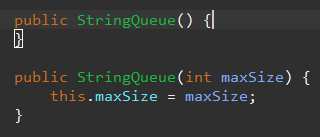
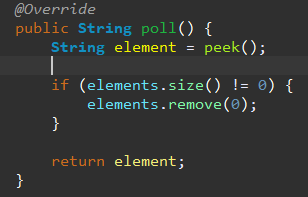
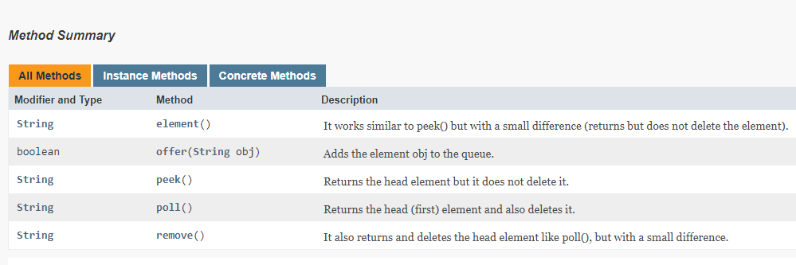
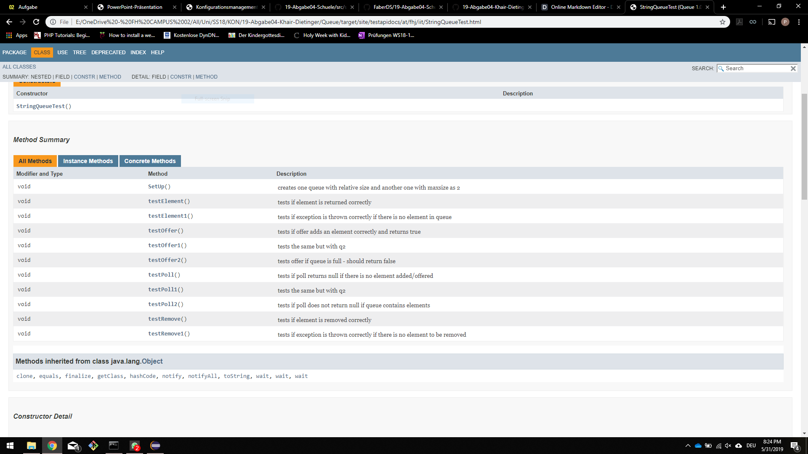
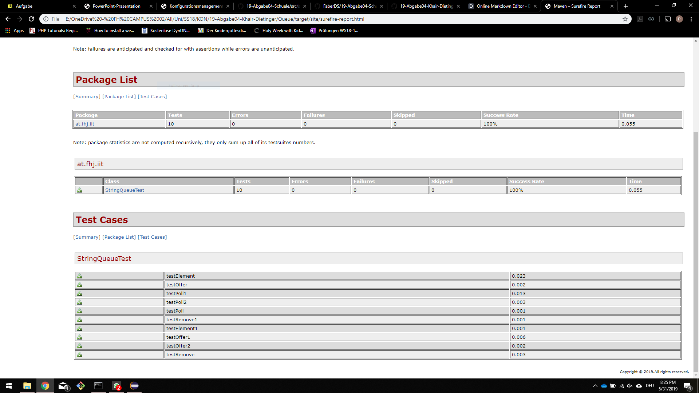
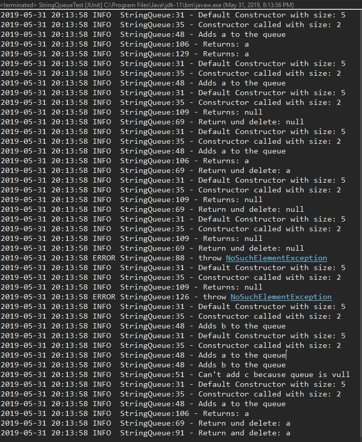

# 19-Abgabe04-Khair-Dietinger
## Abgabe 04
Patrick Khair

Theresa Dietinger
- [x] edit README

----------------------------------------------------------------------------------------------------------------------------------------

## TO-DO

- [x] Übertragen Angabe Taskliste in Markdown Readme 
Das ging grundsätzlich ganz einfach. Wir haben dazu aber Dillinger verwendet. Alles einfügen und durch Markdown formatieren nach belieben. Kästchen für die TO-DO Liste zum Beispiel haben wir durch  "- [ ]" gemacht. 
- [x] Einspielen Queue Vorlage aus Repository: https://github.com/michaelulm/softwareconfiguration-management/tree/master/test-automation/Queue
- [x] Taskergebnisse Schritt für Schritt auf Git stellen 
   - [x] Führrung Taskliste 
  
  War extrem praktisch, denn wir konnten die ganze Zeit einsehen, welche Punkte noch zu erledigen sind.
   - [x] Veröffentlichung in Git mit aktuell durchgeführten Tätigkeiten, z.B. Testfälle geschrieben so wird auch in der Taskliste diese Aufgabe als erledigt markiert und Testfälle inkl. geänderter Taskliste ins Repository übertragen. 
   
---------------------------------

- [x] Korrigieren Sie den Code bzw. Debuggen Sie ihn um die Fehler zu finden 

Durch Debugging-Prozess können Fehler leichter identifiziert werden. In der verwendeten IDE können die einzelne Schritte nachvollzogen werden. Sehr viele Schritte werden gleich oder ähnlich wiederholt.
Sieben Schritte, um Fehler aufzudecken (TRAFFIC):
1.	Track the Problem: Wo taucht der Fehler auf. Wo können mögliche Fehler auftreten
2.	Reproduce it: Wenn Tester Fehler meldet, müssen Schritte nachvollziehbar/reproduzierbar sein. Zufällige Schritte können nicht behoben werden. Durch Testfälle können Fehler vermieden werden
3.	Automate + simplify: Entwickler kennt Programm am besten,
4.	Find possible infection origins: Wenn noch wenige Testcases vorhanden sind, gibt es sehr viele Fehlerquellen
5.	Focuse on most likely origins: Im Debugging-Prozess ist Gefühl notwendig um einzuschätzen wo Fehler auftreten könnten.
6.	Isolate the infection chain
7.	Correct the defect: Bug korrigieren

    - [x] Es befinden sich gesamt 3 Fehler im Source Code.
    
    **Fehler 1:** einmal wird maxsize und einmal maxSize verwendet. Weiters wurde das "this" bei this.maxSize = maxSize vergessen.
      Außerdem wird maxsize bereits davor gesetzt, was bedeutet, dass es auch einen default constructor geben sollte, welcher keine           maxsize mitübergibt. 
      
    **Fehler 2:** element könnte nur entfernt werden, wenn size gleich null ist, was keinen Sinn macht.
    
    **Fehler 3:** String element wird gesetzt. poll wird element zugewiesen, anschließend wird element wieder auf null gesetzt. Daher       macht die anschließende Abfrage ob element gleich null ist, keinen Sinn, da das Element immer null ist. 
    
    - [x] Bei Bedarf Optimieren Sie das Queue Beispiel.
    
    Eine Main-Klasse wurde erstellt, welche einige Funktionen aufrufen kann.
    
    - [x] Ergänzen Sie das Beispiel nach eigenen Ermessen um es testen zu können.
    
    Die StringQueueTest wurde mit Methoden zum Testen befüllt (Code Coverage 100%)
    
----------------------------------------------------------------------------
    
- [x] Erstellen Sie für Klasse und alle Methoden Kommentare um mittels Javadoc eine API Dokumentation zu erzeugen
Motivation für die Dokumentation:

•	Kommentare dienen als Gedankenstütze, gut platzierte Kommentare können viel Zeit sparen

•	Kommentare, welche nicht mehr aktuell sind, können sehr viel Schaden anrichten und Zeit verschwenden

•	Trotz Kommentaren sollte Source Code verständlich formuliert und Variablennamen sprechend sein

•	Wenn dies jedoch nicht ausreicht, werden Fragen wie ‚warum wurde das so programmiert?‘ durch Kommentare beantwortet

•	Jedoch sollten Kommentare nicht nur schlechten und fehlerhaften Code ersetzen.

   - [x] Integrieren Sie ein Bild (der generierten Dokumentation) in Ihren Report. 
    
 
 
----------------------------------------------------------------------------------------------------------------------------------------
 
- [x] Erstellung JUnit Tests (vollständig testen, mehrere Varianten)

JUnit Annotations:

•	@Test: Markiert Test-Methode

•	@Ignore: Tests können ignoriert werden, wenn diese z.B. in Laufzeit nicht ausgeführt werden

•	@Before, @After: vor und nach jedem Test

•	@BeforeClass, @AfterClass: Vor Aufrufen der Klasse und nach Beendigung der Klasse

•	@Test (expected = Exception.class): z.B. FileNotFound-Exception wird geworfen. Test gibt true zurück

•	@Test (timeut = 1000): Test darf z.B. nur eine Sekunde dauern

- [x] Sie werden die „selben“ Testfälle mehrfach erstellen müssen um „mehrere Variationen“ für einen möglichst vollständigen Test zu erreichen. Achten Sie dabei mit unterschiedlichen Daten zu testen.
    - [x] JavaDoc Kommentare erstellen.
    
@author (nur bei Klassen und Interfaces)

@version (nur bei Klassen und Interfaces)

@param (nur bei Methoden und Constructor)

@return (nur bei Methoden, gibt den retournierten Wert an)

@exception (@throws)

@see (Verweise zu anderen Dateien)

@since

   - [x] Integrieren Sie ein Bild (der generierten Dokumentation) in Ihren Report.
    
   
   
    
----------------------------------

- [x] Passen Sie Ihr pom.xml auf das Projekt an, damit Sie das Projekt erstellen aber auch Dokumentation generieren können.
    - [x] EntwicklerInnen Informationen hinzufügen.
    ```xml
     <developers>
        <developer>
            <id>theresadietinger</id>
            <name>Theresa Dietinger</name>
            <email>theresa.dietinger@edu.campus02.at</email>
            <roles>
                <role>Student</role>
            </roles>
            <timezone>Europe/Vienna</timezone>
        </developer>

        <developer>
            <id>patrickkhair</id>
            <name>Patrick Khair</name>
            <email>patrick.khair@edu.campus02.at</email>
            <roles>
                <role>Student</role>
            </roles>
            <timezone>Europe/Vienna</timezone>
        </developer>
    </developers>
    ```
    - [x] Integration Logging Bibliothek log4j mittels Maven Dependencies.
    ```xml
     <dependency>
            <groupId>org.apache.logging.log4j</groupId>
            <artifactId>log4j-api</artifactId>
            <version>2.11.2</version>
        </dependency>
        <dependency>
            <groupId>org.apache.logging.log4j</groupId>
            <artifactId>log4j-core</artifactId>
            <version>2.11.2</version>
        </dependency>
    ```
   
----------------------------------------------------------------------------------------------------------------------------------------
   
- [x] Log4j (Version 2) integrieren und in jeder Methode ins Log schreiben
    - [x] Siehe aktualisiertes Stack Beispiel.
    - [x] Erstellen Sie einen Statischen Logger der auf die Konsole schreibt.
    ```java
    private static final Logger logger = LogManager.getLogger(StringQueue.class);
    ```
    - [x] Konfigurieren Sie Logger über ein properties File.
    
    - [x] Geben Sie eine Info Lognachricht bei Aufruf einer jeden Methode aus.
    ```java
    logger.info("Return und delete: " element);
    ```
    - [x] Geben Sie eine Error Lognachricht aus bevor Sie einen Fehler werfen.
    ```java
    logger.error("throw NoSuchElementException");
    ```
    - [x] Ergebnisse (Konsolenausgabe) als Bild in Dokumentation einfließen lassen.
    
    
    
----------------------------------------------------------------------------------------------------------------------------------------

- [x] Maven Site Dokumentation erstellen
    - [x] Inklusive Javadoc Code und Javadoc Test Klassen
    - [x] Inklusive Menü mit Verweis auf manuell erstellte Seite
    ```xml
     <menu name="19-Abgabe04-Khair-Dietinger">
      <item name="Queue" href="queue.html"/>
    </menu>
    ```
    - [x] Seite erläutert Funktionsweise Queue
    - [x] Geben Sie ein Bild der Maven Site Dokumentation in den Lab Report
    
    
    
    - [x] Der Inhalt der manuell erstellten Seite sollte ersichtlich sein 
      
----------------------------------------------------------------------------------------------------------------------------------------

- [x] Erstellung detaillierter und nachvollziehbarer Markdown Lab Report
    - [x] Übertragung Information aus Labreport Template.
    - [x] Alle Schritte dieser Übung nachvollziehbar erläutern.
    - [x] Übung Github Flavor: Erstellen Sie einen Codeblock im Dokument, welcher 3 Zeilen Python und 3 Zeilen Java Source Code korrekt darstellt.

Python Code:

````python
def hello_world():
    if True:
        print("hello world")
````
Java Code:
````java
public void hello_world() {
    if (true) {
        System.out.println("hello world");
    }
}
````

   - [x] Korrekturlesen Dokumentation
   - [x] PDF erstellen (zB Dillinger)
   
----------------------------------------------------------------------------------------------------------------------------------------
   
- [x] Überprüfung Vollständigkeit der Abgabe
- [x] Abgabe PDF Version der Abgabe
- [x] Sich freuen :)


----------------------------------------------------------------------------------------------------------------------------------------


